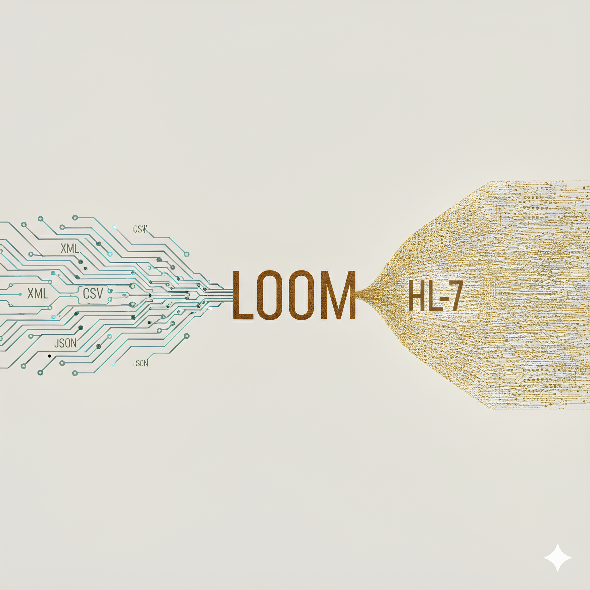

  

# 🧵 LOOM – Akut Klinik Karar Destek & Veri Orkestrasyon Sistemi

**LOOM**, Türkiye’de acil servislere gelen ayakta hastaların yükünü azaltmak ve doktorları klinik riskler konusunda önceden hazırlamak için tasarlanmış katmanlı bir **Klinik Risk Orkestrasyon Sistemi**’dir. 

Türkiye’de acil servislere yıllık **150–170 milyon** civarında başvuru yapılmakta olup, bu başvuruların %99’undan fazlası ambulans dışı (ayakta) gerçekleşmektedir. Başvuran hastaların yaklaşık %65’i **Yeşil (Düşük Acil)**, %35’i **Sarı (Orta Risk)** ve %1-2’si **Kırmızı (Yüksek Acil)** triyaj kategorisine girmektedir. LOOM, özellikle bu yoğunluğu yönetmek üzere uzman hekimlere kritik veri analizi sunar.

## 🧠 Temel İşlevler & Mimari

- **Arka Plan Veri Ön-Çekimi (Pre-fetching):** Hasta triyajdan geçtiği anda HBYS ve e-Nabız dahil devlet servislerinden veri, resmî entegrasyon mantığına uygun şekilde simüle edilerek çekilir. Geçmiş reçeteler, kronik hastalıklar, operasyon geçmişi ve yakın tarihli acil başvurular anında taranır.
- **Klinik Risk Analizi:** Hasta şikayeti ile geçmiş veriler karşılaştırılarak ilaç–ilaç/ilaç–tanı çakışmaları, **EDTB (Erken Dönem Tekrar Başvuru)** paternleri ve kronik + akut risk kesişimleri belirlenir.
- **Dinamik Karar Destek:** Doktor hastayı çağırdığında sistem, kritik riskleri ve sayısal göstergeleri görsel olarak sunar. ML ve temporal analiz ile gözden kaçabilecek risk paternleri tespit edilir. Gerektiğinde **RAG/BERT** modelleri özetleme veya analiz katmanlarında kullanılır. 
- **Zeka Katmanı:** Ana risk motoru deterministik kurallar, temporal/graph tabanlı analiz ve modüler İlaç Güvenliği gibi bileşenler üzerine kuruludur.

## 🛠 Teknoloji Yığını (Planlanan)

LOOM mimarisi modern ve ölçeklenebilir bir stack üzerine kurgulanmıştır:
- **FastAPI:** Yüksek performanslı asenkron API servisleri.
- **RabbitMQ:** Sistemler arası veri akışı ve mesajlaşma yönetimi.
- **Docker:** Container tabanlı modüler dağıtım.
- **Python (LoomAtlas Engine):** Klinik zeka ve veri işleme motoru.

> [!NOTE]
> **Sentetik Veri Motoru:** LOOM projesi içinde veri üretimi için **Synthea** kütüphanesi kullanılmaktadır. Bu kütüphane, Türkiye’nin demografik yapısına ve Sağlık Bakanlığı/TÜİK verilerine göre revize edilerek gerçeğe en yakın **Türk Hasta Popülasyonu** üretimi için özelleştirilmiştir. Bu bilgi sadece veri motoru kapsamında geçerlidir.

---
*Bu proje bir Web Dersi kapsamında geliştirilen bir Klinik Akıl simülasyonudur.*
